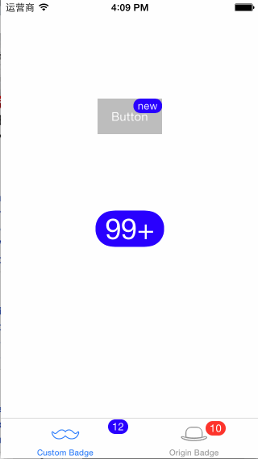

# RTDraggableBadge

[](https://travis-ci.org/rickytan/RTDraggableBadge)
[](http://cocoapods.org/pods/RTDraggableBadge)
[](http://cocoapods.org/pods/RTDraggableBadge)
[](http://cocoapods.org/pods/RTDraggableBadge)

This project is inspired by Mobile **QQ**, a drag to clear badge view.

## Usage

To run the example project, clone the repo, and run `pod install` from the Example directory first.

```objective-c
[self.button rt_setBadge:@"new"
              withHandle:^(RTDraggableBadge *badge, RTDragState state) {
                  if (state == RTDragStateDragged) {
                      badge.text = @"n";
                  }
              }];

RTDraggableBadge *badge = [RTDraggableBadge badgeWithDragHandle:^(RTDraggableBadge *badge, RTDragState state) {
    if (state == RTDragStateDragged) {
        // do clear your badge number
    }
}];
```

## TL;DR

See the demo below:



## Requirements

* iOS 7+
* Xcode 6+

## Installation

RTDraggableBadge is available through [CocoaPods](http://cocoapods.org). To install
it, simply add the following line to your Podfile:

```ruby
pod "RTDraggableBadge"
```

## Author

- rickytan, ricky.tan.xin@gmail.com

## License

RTDraggableBadge is available under the MIT license. See the LICENSE file for more info.
